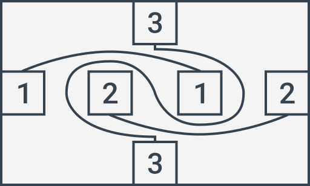

# Три линии

Ведущий рисует на бумаге следующий рисунок:

Требуется соединить блоки согласно их номерам **тремя непересекающимися линиями**. По границам блоков линии проводить нельзя. Через блоки линии также нельзя рисовать. Выходить за границы основной площадки нельзя. По ее границам проводить линии нельзя.

---

**Разгадка** <!-- !details -->

Смотрите на рисунок:

---
