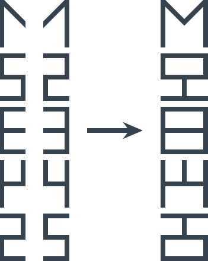

# Дополни символ

Ведущий показывает рисунок зрителям (процесс рисования зрители видеть не должны):

Нужно нарисовать следующий символ. Ну и последующие.

---

**Разгадка** <!-- !details -->

На самом деле это не японские иероглифы, а цифры с зеркальным отражением:

А, следовательно, следующие символы выглядят так:

Или так:

---
