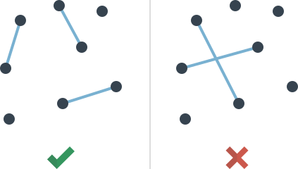

# Отрезки

Итак, вначале на листике произвольно ставятся точки (больше 15). Чем больше точек, тем дольше идет игра.

Игроки по очереди **соединяют любые две точки отрезками**. Отрезки **не должны пересекаться**. Каждая точка может служить концом только одно отрезка, то есть от одной точки не может идти больше одного отрезка.

Проигрывает тот, кто не может сделать ход.

На рисунке ниже показана правильная партия и неправильная, так как там отрезки пересекаются:

Автор: Юрий Гурин.
