# Интеллектуальный футбол на бумаге

Цель игры — загнать «мяч» в ворота противника.

Вначале на листе бумаги рисуется поле **8 на 12**. В центр его рисуется крупная точка — начальное положение мяча, а снизу и сверху три точки посередине границ поля — ворота игроков:

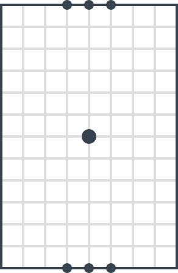

Начинают играть по жребию. Но стоить помнить, что игрок, начинающий первый имеет небольшое преимущество в игре.

Мяч может находиться **только на углах клеток**.

На **границах поля** мяч находиться **не может**, ибо при попадании на них игрок получает дополнительный ход (мяч отбивается от стенки). Исключение составляет только **момент попадания мяча в ворота**. Мяч со своего места переходит на соседний свободный угол клетки. В общем случае вокруг мяча может быть **до 8 таких углов**.

Рассмотрим **ход игры**. Игрок рисует отрезок с концами на углах клеток: первый — это тот, где находится в данный момент мяч (где противник закончил предыдущий ход), второй — любой соседний (по вертикали или горизонтали), если до этого во время игры два угла не были соединены отрезком (то есть между ними не нарисовано линии).

На рисунке ниже видно, что мяч может попасть в 8 разных позиций из центра поля:

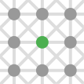

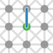

Если вы или противник до этого во время игры соединили две уголка клетки, то вы не можете опять их соединить. За игру вы каждые два уголка клетки можете соединить только один раз, то есть **ходить можно там, где еще не ходили**.

На рисунке ниже показаны всевозможные ходы за время всей игры:

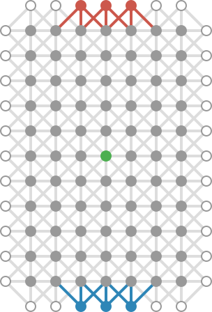

Зеленым обозначено начальное положение мяча. Серым обозначены обычные размещения мяча. Красным и синим обозначены ворота и ходы, приводящие к победе.

Обратите внимание, что углы клеток по границе игрового поля (белые с серой границей) **нельзя соединять по вертикали и горизонтали**.

На этом ход игрока заканчивается. Но при соблюдении некоторых условий игрок получает **право дополнительного хода**.

Если игрок своим отрезком **коснулся уголка клетки**, из которого уже нарисованы какие-нибудь другие отрезки, то он может сделать дополнительный ход:

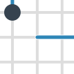

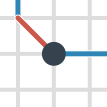

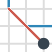

Если игрок своим отрезком **ходом по диагонали пересек** другой уже нарисованный отрезок, то он может сделать дополнительный ход:

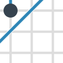

Если игрок вторым концом своего отрезка **ударился о границу поля**, то он может сделать дополнительный ход:

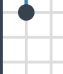

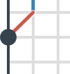

Первые два случая называются «**пасом**», а третий — «**ударом от борта**».

Если после рисования дополнительного отрезка выполнилось любое из трех условий, то игрок получает **право еще одного дополнительного хода**. Тем самым за ход игрок может сделать очень длинную цепочку.

**Важно! Отрезки рисуются цепочкой!** То есть если нарисованный отрезок вторым концом лег на угол, то следующий отрезок (игрока или противника) должна начинаться с этого же угла.

В конце хода на уголке клетки, где остановился мяч, рисуется точка крупная — там находится теперь мяч. После этого ходит противник.

Если игрок **попал в тупик**, то он **проигрывает**. Попасть в тупик — значит, что игрок вынужден нарисовать отрезок и вторым концом попасть на уголок, с которого хода для другого игрока нет.

Игра заканчивается, когда отрезок вторым концом **попадает в ворота противника**.

На рисунках ниже показано несколько первых ходов:

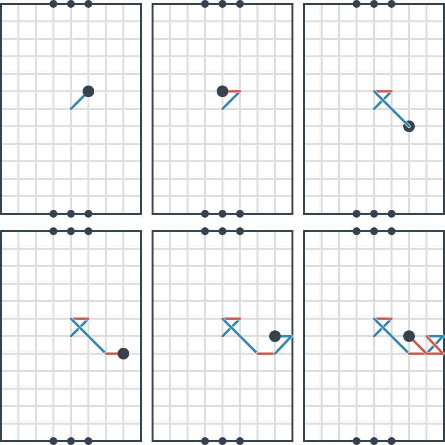

Автор: Браништи Влад.
