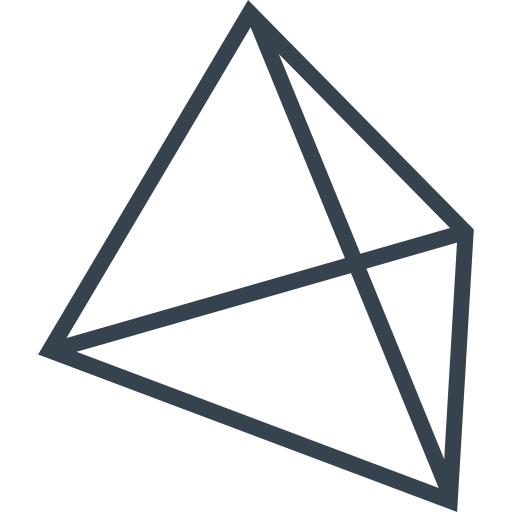
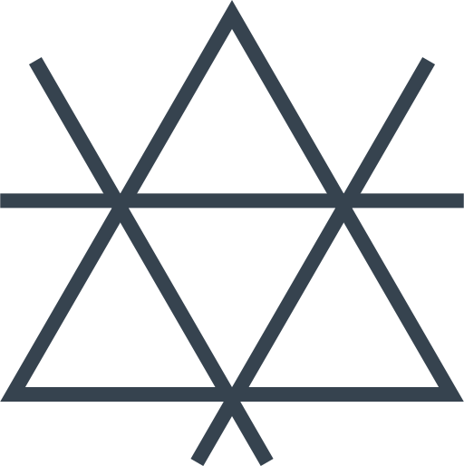

# Из 6 спичек 4 треугольника

Как из 6 спичек собрать зараз 4 равносторонних треугольника со стороной в 1 спичку?

---

**Разгадка** <!-- !details -->

В виде тетраэдра. В условиях задачи не было сказано, что всё нужно делать в двумерном пространстве:

Если задача будет такая: «Как из 6 спичек собрать зараз 4 равносторонних треугольника?», то решениями могут служить такие варианты на двумерной плоскости:

---
