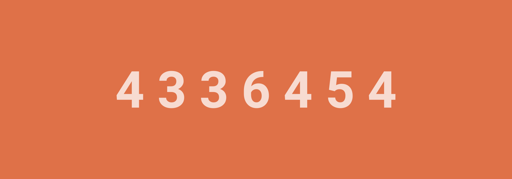

# 4 3 3 6 4 5 4



Ведущий рисует на бумаге следующие числа:

```text
4 3 3 6 4 5 4
```


_Рисунок 1 — Числа_

Нужно дописать следующие числа.

---

**Разгадка** <!-- !details -->

Эти числа равны числу букв в названиях ряда натуральных чисел: один (**4**), два (**3**), три (**3**), четыре (**6**), пять (**4**), шесть (**5**), семь (**4**) и так далее. Значит, следующие числа в ряду: **6, 6, 6, 11**.

---
