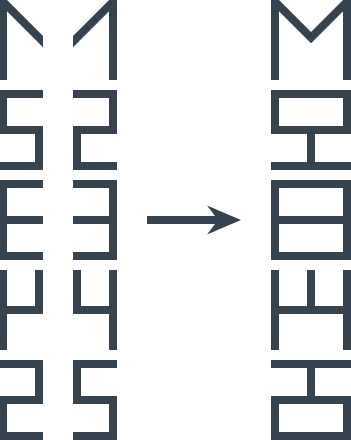

# Дополни символ

Ведущий показывает рисунок зрителям (процесс рисования зрители видеть не должны):

_Рисунок 1 — Рисунок задачи_

Нужно нарисовать следующий символ. Ну и последующие.

---

**Разгадка** <!-- !details -->

На самом деле это не японские иероглифы, а цифры с зеркальным отражением:

_Рисунок 2 — Решение_

А, следовательно, следующие символы выглядят так:

_Рисунок 3 — Следующие символы_

Или так:

_Рисунок 4 — Другой вариант семерки_

---
