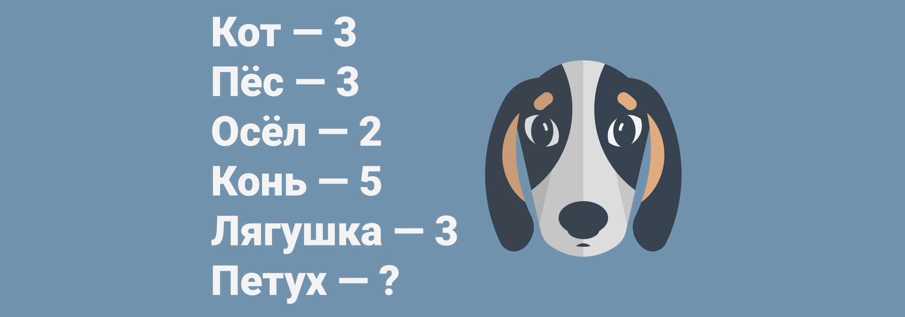

# Животные и числа



Ведущий рисует на бумаге следующее:

```text
Кот - 3
Пёс - 3
Осёл - 2
Конь - 5
Лягушка - 3
Петух - ?
```

Нужно приписать правильное число в последней строке.

---

**Разгадка** <!-- !details -->

Число соответствует числу букв в звуке, который издает животное. Например, кошка говорит «**мяу**», и ей соответствует число **3**.

А конь издает «**иго-го**», где **5** букв.

Значит, раз петух издает «**кукареку**», тот ответом будет число **8**.

---
