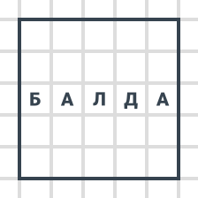
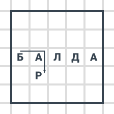
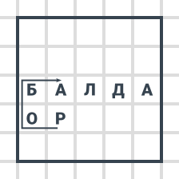

# Балда

На листке рисуется квадрат 5 на 5. И на третей строке пишется слово из пяти букв, например, «БАЛДА»:

После этого игрока по очереди пишут **по букве** в пустых клетках. При этом должно получиться слово, которое представляет собой существительное в именительном падеже единственном числе. При этом должны для этого слова выполняться условия:

1. Слово должно **содержать добавленную букву**.
2. Слово составляется из букв **по смежным переходам**, то есть из одной буквы к другой можно попасть по прямым углам (не по диагонали).
3. Любая буква в квадрате может **использоваться** в качестве буквы для слова лишь **один раз**.
4. Буквы «**е**» и «**ё**» одинаковые.

После этого игроку приписываются **очки в виде числа букв** в этом слове. После этого право добавления буквы переходит к другому игроку.

Игрок имеет право пропустить ход.

Выигрывает игрок с большим количеством очков. Игра заканчивается при заполнении всех клеток.

Пример первых двух ходов:

