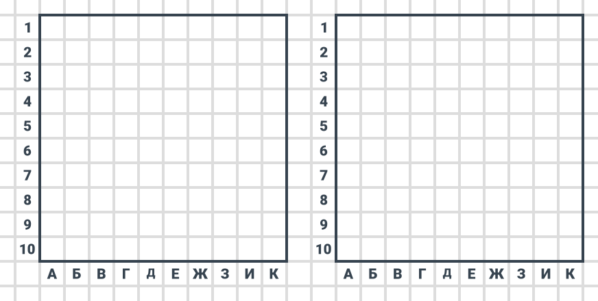
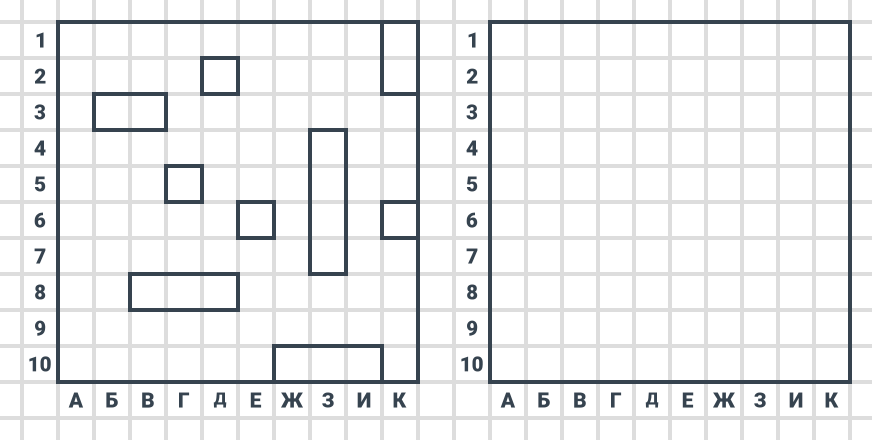
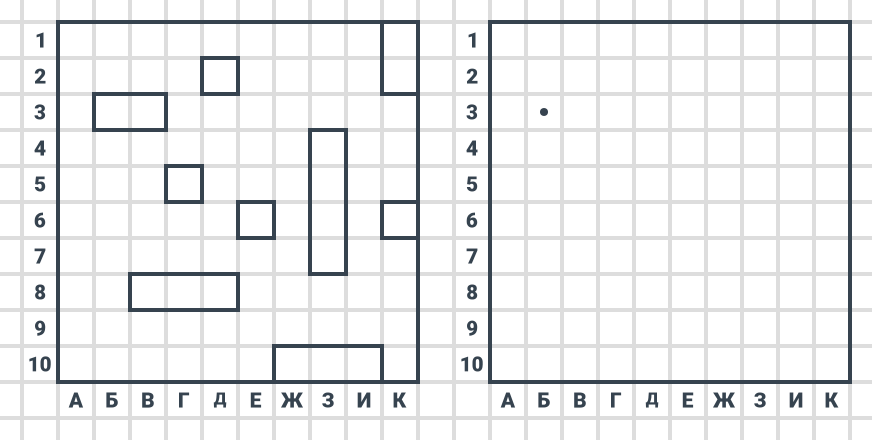
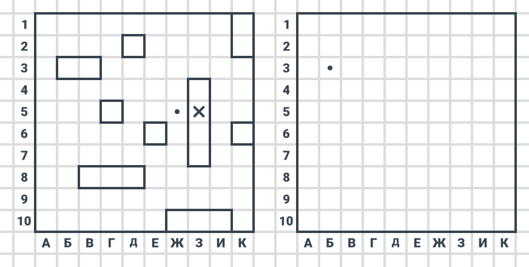

# Морской бой

Каждый из игроков рисует у себя на листке (друг другу листки нельзя показывать) два квадрата 10 на 10, номеруя столбцы от «А» до «К», а строки от 1 до 10:

Первое поле — это поле собственное, а второе — это поле противника, куда игрок будет бить своими ударами.

На первом поле игрок размещает корабли: **1** из четырех клеток, **2** из трех клеток, **3** из двух клеток, **4** из одной клетки. Например, так:

При этом корабли **не могут соприкасаться или касаться друг друга**. Но могут вращаться на 90 градусов. Размещение кораблей производится на усмотрение игрока.

Цель игры — **первым уничтожить все корабли противника**.

После размещения кораблей по жребию определяют того, кто будет начинать. Игрок, которого выбрали, ставит на своем листке на поле противника в какой-нибудь клетке точку и называет ее координаты, например, **Б3**. Второй игрок ставит точку на своем поле, где находятся его корабли, с этими координатами.

Если эта клетка принадлежит кораблю, то игрок говорит «**попал**», если корабль имеет еще целые клетки, и «**убил**», если это была последняя целая клетка корабля.

Если это клетка пустая и не содержит корабля, то игрок говорит «**мимо**».

Если там был корабль, то точка превращается в крестик у обоих игроков.

Если игрок попал в корабль (или убил), то у него появляется **право на дополнительный выстрел**, если попал еще раз (или убил), то право дополнительного выстрела появляется заново и так далее. После хода другой игрок стреляет по полю противника. И так далее до победы.

Ниже показаны два хода: первого и второго игрока:

