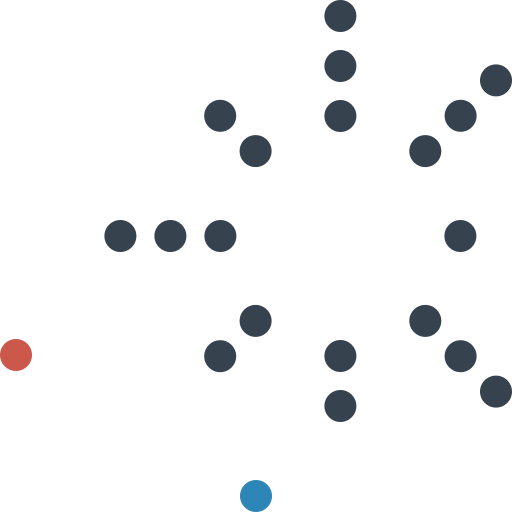

# Догонялки по кругу

Подвижная игра. Все кроме двух участников встают в довольно широкий кружок **в несколько рядов затылок в затылок** (в ряду по несколько человек). То есть люди встают в некое такое солнышко:

_Рисунок 1 — Пример начальной позиции_

Один из двух участников — **догоняющий**, а второй — **догоняемый**. Красным обозначен **догоняющий**, а синим — **догоняемый**:

_Рисунок 2 — Выбранные игроки в начале игры_

Задача догоняющего — **коснуться догоняемого**. Если это происходит, то они **меняются ролями**. Пример ситуации в игре показан на рисунке:

_Рисунок 3 — Пример ситуации на игре_

Догоняемый кроме традиционного убегания имеет возможность **защитить себя**. Для этого он может встать **в конец любого ряда**:

_Рисунок 4 — Игрок встает в конец ряда_

После этого новым догоняемым автоматически становится **первый человек из этого ряда**:

_Рисунок 5 — Замена догоняемого_

Игроки при этом я ряду немного сдвигаются, чтобы ряд не отдалялся от центра:

_Рисунок 6 — До сдвига_

Итоговая ситуация после сдвига:

_Рисунок 7 — Итоговая ситуация после сдвига_
