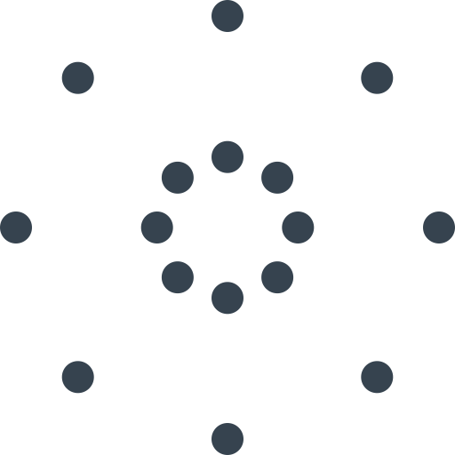

# Поменять внутренний и внешний круг

Подвижная игра. Участники делятся на две равные группы.

Люди одной группы ставятся в маленький круг, лицом во внешний круг. Люди группой группы становятся во внешний круг, лицом во внутренний круг:

Дается время на то, чтобы люди во внутреннем круге запомнили расположение людей во внешнем круге. Желательно запоминать нескольких людей напротив.

Потом участники во внешнем круге в случайном порядке меняются местами в круге, например, перебегают напротив в другую сторону внешнего круга, или меняются местами.

После окончания перебеганий, участники во внутреннем круге должны переставить участников внешнего круга, чтобы восстановить прежнее положение. В конце восстановления внешний круг говорит об ошибках, и два круга меняются местами, и всё повторяется.
