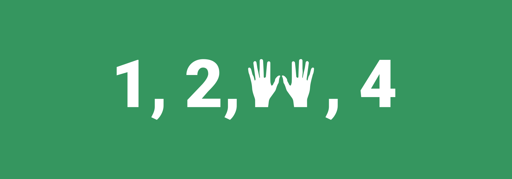

# Сосчитать до 40

Люди встают в **кружок** вместе с ведущим.

Ведущий объявляет, что сейчас будем считать до **40**, но особым образом. Числа называем по очереди, начиная с ведущего, по правилам ниже.

Если число **содержит 3** в своем написании или **делится на три**, то человек **подпрыгивает и хлопает в ладоши**, иначе называем число.

То есть ведущий говорит «один», следующий — «два», следующий — прыгает и хлопает, следующий — «четыре», следующий — «пять», следующий — «прыгает и хлопает», следующий — «шесть», и так далее по кругу. Как видим, прыгать и хлопать нужно при следующих числах: 3, 6, 9, 12, 13, 15, 18, 21, 23, 24, 27, 30, 31, 32, 33, 34, 35, 36, 37, 38, 39.

Особое сложное место в конце, где подряд прыгают и хлопают 10 человек. Как только кто-нибудь сбивается, то начинают с того, кто ошибся.
