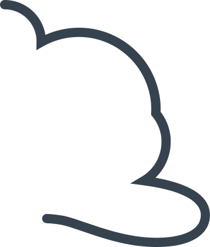
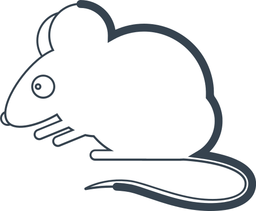

# Кривая линия

Один из людей рисует на бумаге любую закорючку. Задача второго дорисовать ее до какого-нибудь объекта или рисунка.

Например, человек нарисовал такую линию:

Второй человек, например, дорисовывает мышь:

