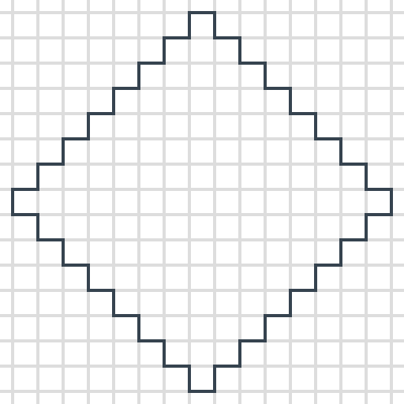
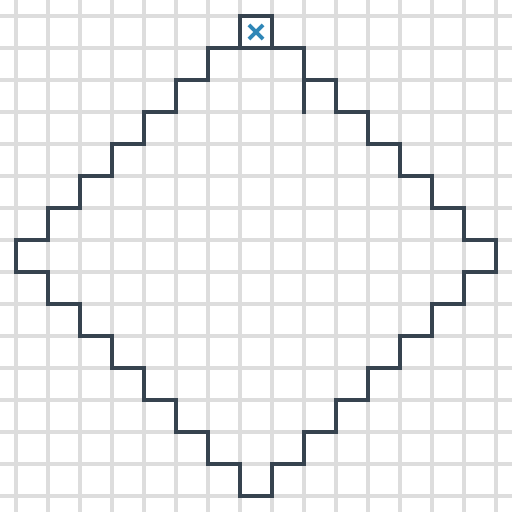
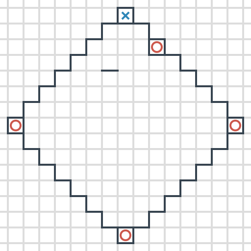

# Палочки в ромбе

На листочке рисуется ромб любого размера. Обычно 8 на 8.

Границы ромба не участвуют в игре, в отличие от игры [Палочки](/games/dashes/), то есть считается, что границы ромба уже проведены.

Определяется, кто играет крестиками, а кто ноликами. После этого игроки по очереди рисуют внутри этого ромба отрезки по вертикали и горизонтали (вдоль клеточек листика) длины 1, то есть отрезок — сторона какой-нибудь клеточки.

Если очередным ходом игрок **обрисовывает целую клеточку**, то внутри этой клеточки **ставит свой знак**. И получает **право еще на один ход**.

В детстве я играл по правилам, когда дополнительный ход добавляется каждый раз после закрытой клетки. По желанию можно принять правила, как в игре [Палочки](/games/dashes/), когда дополнительный ход может быть только один.

Игра заканчивается, когда все клеточки будут заняты. После игры подсчитывается количество поставленных знаков. Выигрывает, естественно, у кого **заполненных клеток больше**.

Ниже показана часть игры (2 первых хода).

Ниже показано несколько ходов:

_Рисунок 1 — Начальное поле игры_

_Рисунок 2 — Первый игрок сделал первый ход_

_Рисунок 3 — Второй игрок сделал первый ход_
