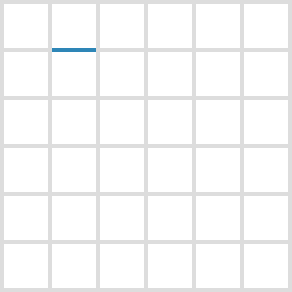
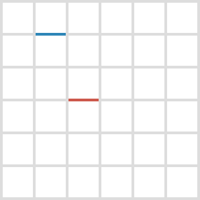
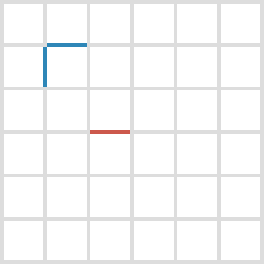
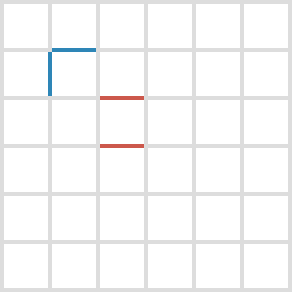
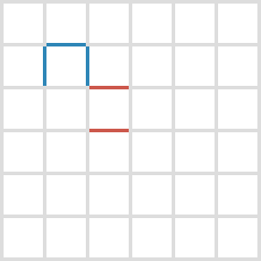
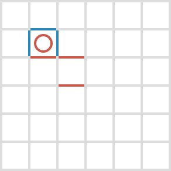
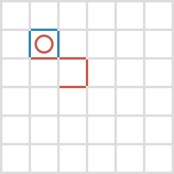
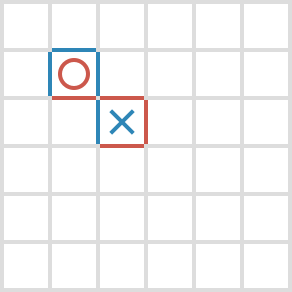
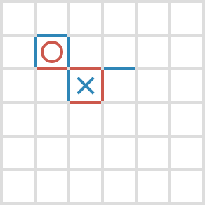

# Палочки

На листочке рисуется квадрат **6 на 6** (тонко обрисовывается, так как границы квадрата также участвуют в игре). Определяется, кто играет крестиками, а кто ноликами.

После этого игроки по очереди **рисуют отрезки** внутри этого квадрата (и по границам) по вертикали и горизонтали (вдоль клеточек листика) длины 1, то есть отрезок — сторона какой-нибудь клеточки. Можно использовать ручки разного цвета.

Если очередным ходом игрок **обрисовывает целую клеточку**, то внутри этой клеточки **ставит свой знак**. И получает **право еще на один ход**. Если игрок закрывает две клеточки, то ему засчитываются две клеточки, но ход дополнительный — один.

Игра заканчивается, когда все клеточки будут заняты (36 штук). После игры подсчитывается **количество поставленных знаков**. Выигрывает, естественно, у кого их больше.

Ниже показано несколько ходов:

