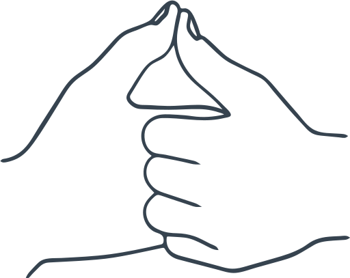

# Борьба пальцев

Два человека сцепляются пальцами правых рук **в замок**, а большими пальцами упираются **друг в друга**.

Цель игры — **замять палец другого**, то есть перебороть противника и положить палец противника «на лопатки»:

_Рисунок 1 — Пример положения рук во время игры_
