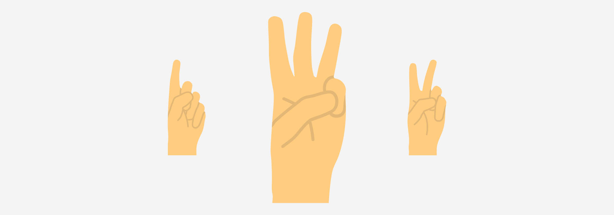

# Пальцы

Ведущий говорит: «Ваша задача определить, **сколько я показываю пальцев**». И ничего другого не объясняет. Только как всегда, предупреждает, что, если кто-то отгадает или знает загадку эту, то тот остальным ее не рассказывает.

Ведущий на одной руке показывает несколько пальцев (например, три), и говорит: «**Допустим, это пять**». Теперь показывает **четыре** пальца: «**А сколько теперь пальцев?**» Выслушивает версии и говорит правильный ответ: «Здесь **три** пальца». Показывает **один** палец: «Сколько пальцев?». Правильный ответ теперь — **четыре** пальца.

Разгадка

Основано на запаздывании, и показывает инертность нашей памяти.

Число показываемых пальцев равно числу пальцев на руке, которые были показаны **на предыдущей итерации**.

То есть, вначале ведущий показал три пальца. Потом показывает четыре пальца. И здесь игроки должны сказать, что он показывает три пальца, так как на предыдущем такте показывал три пальца.

Ну а фраза вначале: «Допустим, это пять», всего лишь для отвода глаз. Рекомендуется при загадывании несколько раз начинать сначала.

