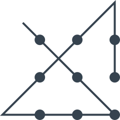

# Четыре отрезка

Классическая задача. Даны 9 точек:

_Рисунок 1 — Рисунок задачи_

Требуется **четырьмя отрезками**, образующими **непрерывную линию**, соединить все 9 точек точки, чтобы каждая точка пересекалась один раз.

---

**Разгадка** <!-- !details -->

Обычно люди не выходят за рамки квадрата, что не позволяет решить задачу. Задача имеет решение:

_Рисунок 2 — Решение_

---
