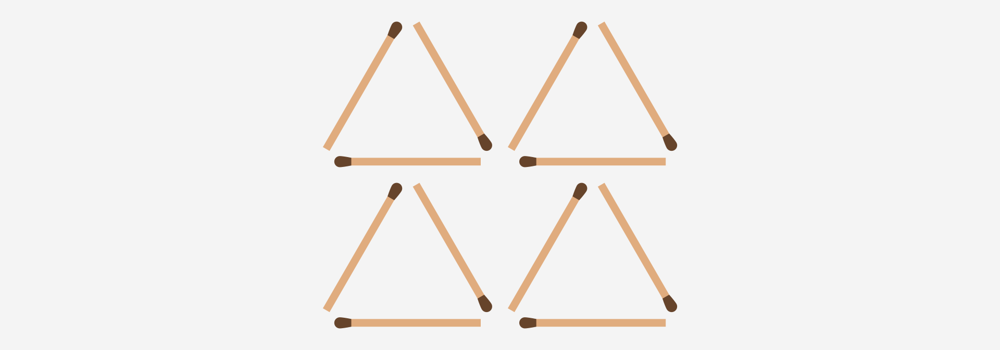
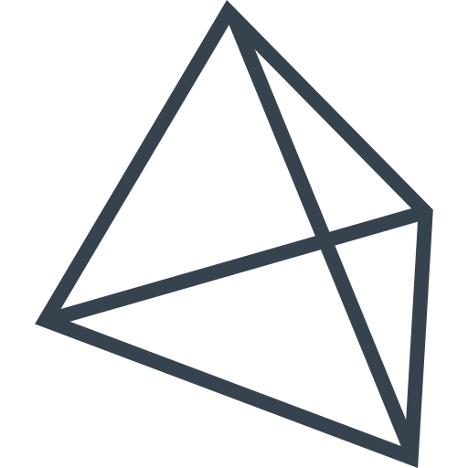
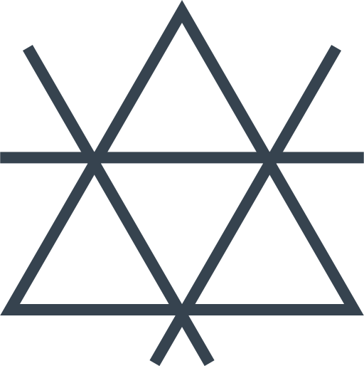

# Из 6 спичек 4 треугольника

Как из 6 спичек собрать зараз 4 равносторонних треугольника со стороной в 1 спичку?

Разгадка

В виде тетраэдра. В условиях задачи не было сказано, что всё нужно делать в двумерном пространстве:

_Рисунок 1 — Решение задачи_

Если задача будет такая: «Как из 6 спичек собрать зараз 4 равносторонних треугольника?», то решениями могут служить такие варианты на двумерной плоскости:

_Рисунок 2 — Частичное решение задачи_

_Рисунок 3 — Второе частичное решение задачи_

