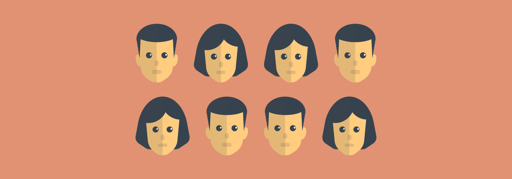

# Угадать, кого загадали

Ведущий выбирает жертву (разговорчивую), отправляет ее за дверь, а другим игрокам объясняет правила.

Потом жертву приглашает в зал, и говорит, что **загадали** кого-то из участников. Требуется **отгадать** этого человека.

При этом жертва может задавать простые вопросы: «Этот человек имеет волосы? Он толстый? У него красная рубашка?». И просит какого-нибудь участника ответить на очередной вопрос, что этот участник и делает. Потом на другой вопрос отвечает другой участник.

Когда жертва понимает, что что-то не так, ведущий уже просит понять алгоритм того безобразия, которое творится.

Разгадка

Когда участники отвечают на вопросы, то они отвечают про соседа слева. Поэтому и получается такая неразбериха.

