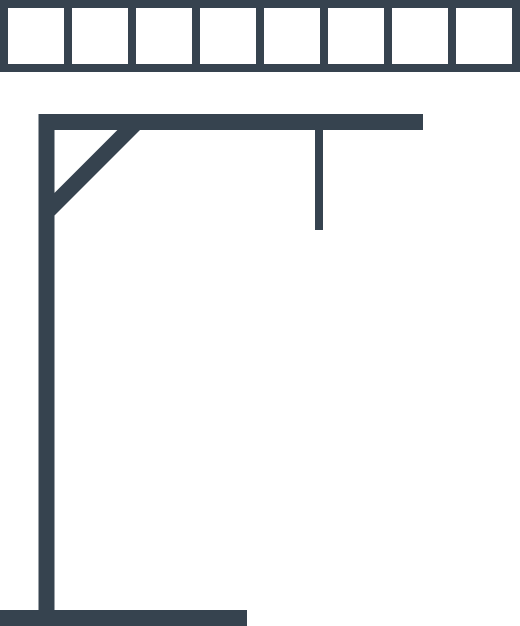
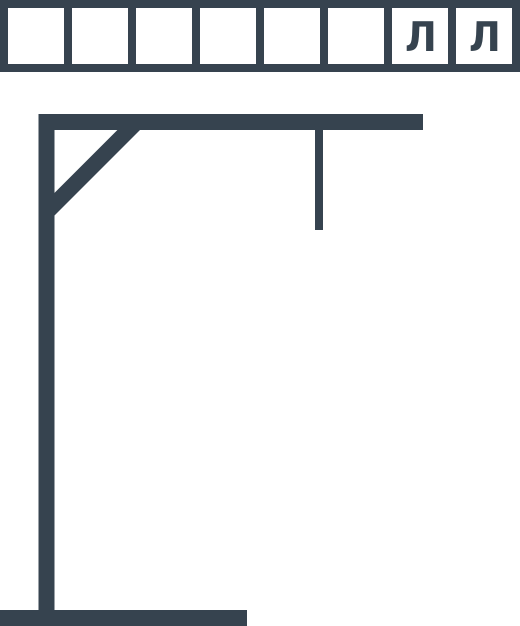
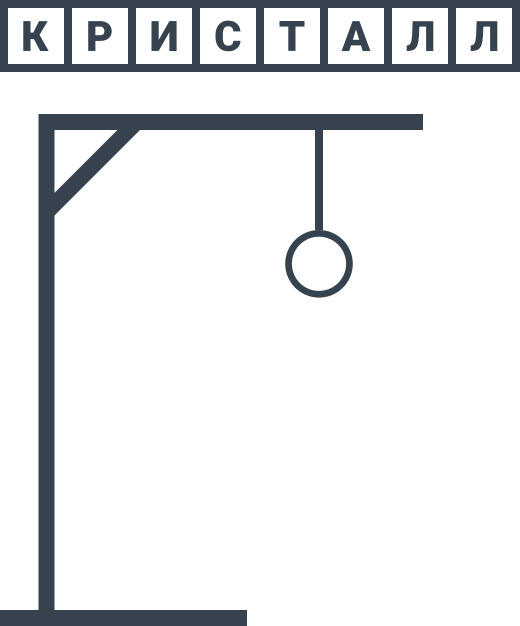
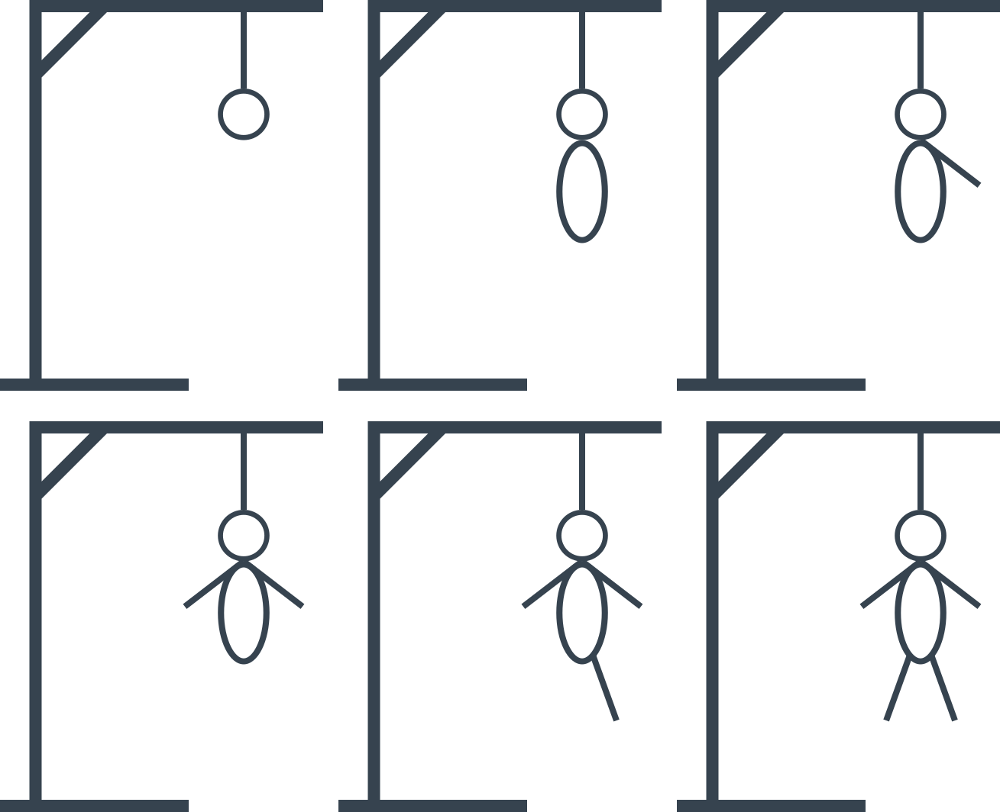

# Виселица

Один из игроков загадывает слово (существительное, единственное число, именительный падеж), и желательно оно должно быть не очень длинным, например, «КРИСТАЛЛ». И на листке зарисовывает столько квадратиков, сколько букв в слове. А рядом рисует виселицу:

_Рисунок 1 — Начало игры_

Второй игрок называет любую букву, которая, по его мнению, есть в слове. Если она есть, то все эти буквы в нужных местах ставятся в квадратиках. То есть, если была названа буква «**Л**», то должно быть:

_Рисунок 2 — Отгаданные буквы_

Если же буквы нет, то дорисовывается компонент на виселице, дорисовывая человека в петле. Далее отгадывающий игрок называет следующую букву и так далее. Отгадывающий игрок выигрывает, если успеет отгадать всё слово до момента, когда человечек будет дорисован:

_Рисунок 3 — Пример победной ситуации_

В противном случае проигрывает. Всего частей в рисунке, что дорисовываются — шесть: голова, туловище, руки, ноги. Стадии нарисованы ниже:

_Рисунок 4 — Все шесть состояний виселицы_
