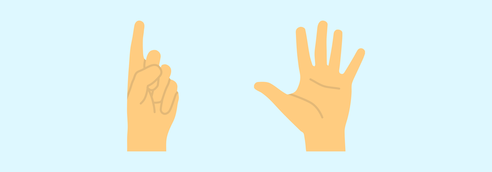

# Сколько пальцев

Ведущий говорит, что задача людей говорить, **сколько он будет показывать пальцев**.

Показывает сколько-то пальцев на руке, например, два, и спрашивает: «**Сколько пальцев показываю?**» Зрители говорят, что два, а ведущий говорит, что **три**. И так далее. Задача зрителей — догадаться о принципе игры.

---

**Разгадка** <!-- !details -->

Число пальцев равно числу слов в вопросе ведущего.

Если ведущий спрашивает: «**Сколько пальцев показываю?**», то пальцев **три**.

Если спрашивает: «**На этот раз посчитайте пальцы**», то пальцев **пять**.

Если спрашивает: «**Сколько?**», то пальцев **один**.

Если спрашивает: «**А тут сколько?**», то пальцев **три**.

---
