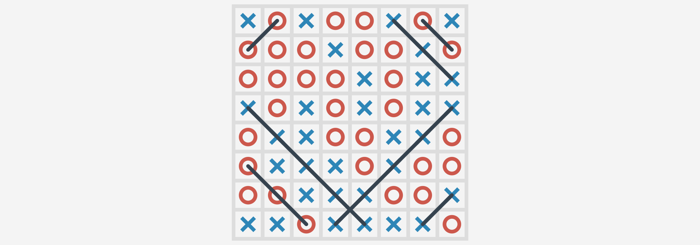
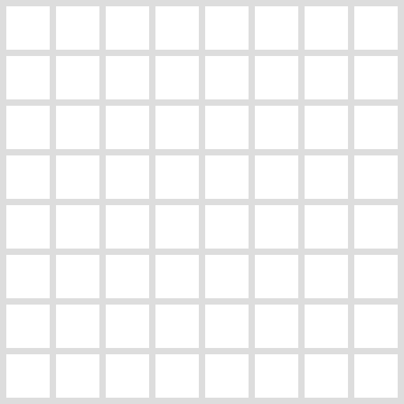
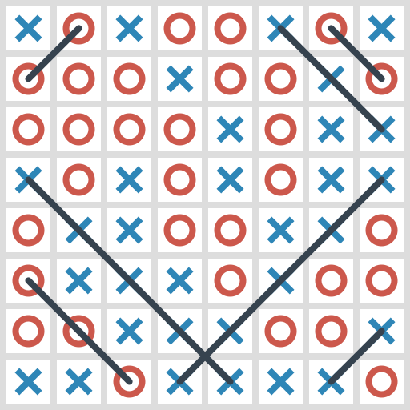
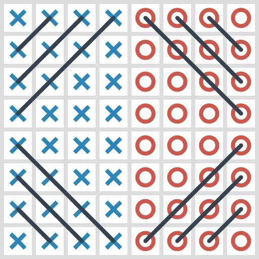
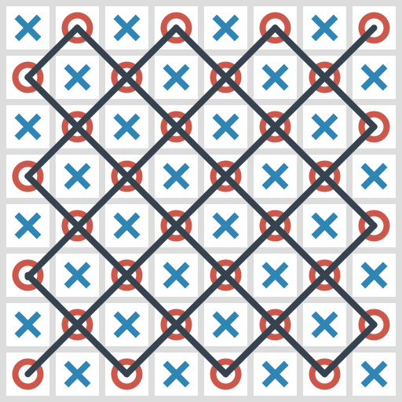
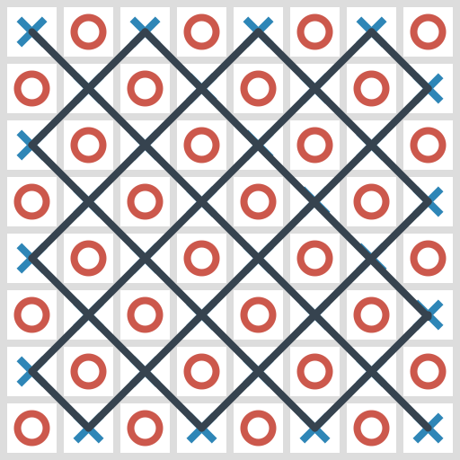

# Наибольшее количество диагоналей

Ведущий рисует на доске или листе бумаги сетку из квадратов 8 на 8:

Участники делятся на две команды и встают перед листом бумаги в две колонны. Первым в колонне даются ручки. Одна команда выбирает для себя крестики, другая — нолики.

Ведущий объявляет задачу: «Необходимо нарисовать каждой команде **максимальное** количество заполненных диагоналей своими знаками».

Рисуют участники по очереди: вначале рисует участник одной команды, потом другой команды.

Рисовать нужно быстро: максимум 3 секунды на постановку своего знака, и ведущий постоянно подгоняет игроков. Исправлять нельзя неправильно поставленный знак.

Когда участник нарисовал свой знак, он идет в конец колонны.

Процесс рисования заканчивается, когда все клетки не будут заполнены. После этого подсчитываются очки по числу диагоналей. Например, будет вот такая картина:

Здесь команда ноликов получила 3 очка, а команда крестиков — 4 очка.

После этого ведущий напоминает задачу: «Необходимо нарисовать каждой команде максимальное количество заполненных диагоналей своими знаками». Рисует еще один квадрат 8 на 8, и игра повторяется. Либо на второй раз, либо через несколько итераций (несколько игр) люди приходят к такой версии (но могут сразу прийти к оптимальной), где у каждой команды по 6 очков:

Между каждой итерацией ведущий дает время командой 1 минуту на общение, как внутри команды, так и с другой командой. В последнем случае у каждой команды по шесть очков. Но ведущий говорит, что можно больше и предлагает еще один квадрат 8 на 8. Наконец люди обычно приходят к оптимальному варианту.

После этого варианта ведущий объявляет о том, что участники справились с заданием.

---

**Решение и результаты** <!-- !details -->

Решение, где у ноликов и у крестиков по 13 очков:

Ведущий напоминает всем, что задание звучало так: «**Необходимо нарисовать каждой команде максимальное количество заполненных диагоналей своими знаками**».

Тут **не говорится** о том, что выиграет какая-то команда, и что это вообще соревнование между двумя командами.

Сам факт разделения на две команды участники самостоятельно воспринял как сигнал к соревнованию с другой командой. Так происходит и в жизни. Достаточно разделить даже искусственно коллектив на две группы, как возникает соперничество, тогда как сотрудничество может быть гораздо продуктивнее.

Второй вариант окончания игры, когда поле поделили на две половины, показывает еще один из вариантов взаимодействия двух команд, которые разделили сферы влияния и действуют независимо друг от друга, но не заходят на чужую территорию.

Часто в этой игре находятся люди, которые берут в командах на себя лидерство, чтобы давать команды, кто и что ставит на листе бумаги.

---
