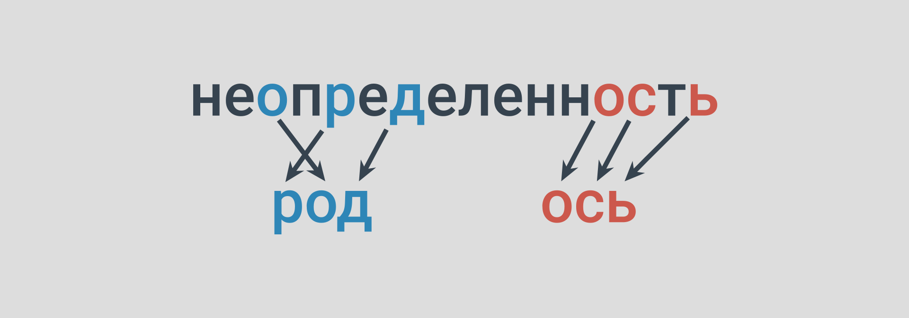

# Составь слова

Классическая игра. Лучше играть вдвоем.

Игроки выбирают **одно существительное** в единственном числе (например, `неопределенность`), записывают на листе бумаги.

Потом начинают поочередно придумывать слова (нарицательные существительные в единственном числе или множественном, если в единственном не употребляется, аббревиатуры и сокращения не допускаются), **состоящие из букв исходного слова**.

Например, можно составить такие слова: `ось`, `предел`, `род`, `лен`, `определенность` и др.

Очки даются **за количество букв в слове**. В составленном слове не может быть одинаковых букв больше, чем в исходном слове. Например, в данном примере в составленном слове не может быть больше трех «н», так как в слове «неопределенность» три буквы «н».

Буквы «е» и «ё» считаются одинаковыми, а «и» и «й» — разными. Игра заканчивается, когда новые слова уже не придумываются.

Выигрывает тот, у кого очков больше.
