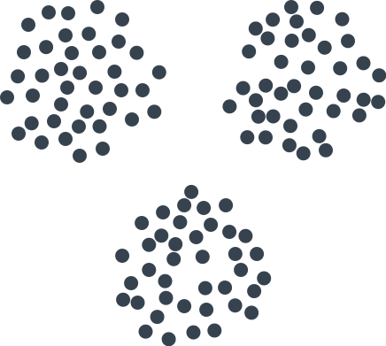

# Мизер

Это обратный аналог игры ним. Из множества мелких предметов формируется приблизительно равные **три кучки**:

После этого игроки начинают по очереди забирать себе предметы из кучек.

Правило взятия такое: можно забирать любое количество предметов из кучки (вплоть до всей кучки), но только **из одной какой-нибудь кучки**. То есть взять за ход из одной кучки один предмет и из другой кучки — нельзя.

Тот, кто **взял последний предмет** — проигрывает.
