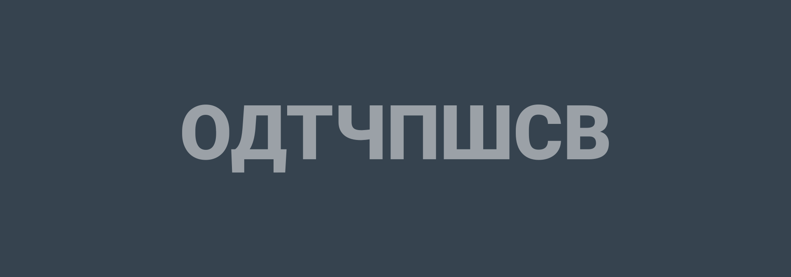

# ОДТЧПШСВ



Ведущий рисует на бумаге следующие буквы:

```text
ОДТЧПШСВ
```


Нужно дописать следующую букву.

---

**Разгадка** <!-- !details -->

Эти буквы — это первые буквы числового ряда: **О**дин, **Д**ва, **Т**ри, **Ч**етыре, **П**ять, **Ш**есть, **С**емь, **В**осемь, **Д**евять, **Д**есять, **О**диннадцать и так далее. Значит, следующие буквы в ряду: **Д**, **Д**, **О**, **Д**, **Т**, **Ч**.

---
