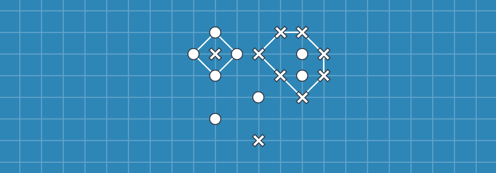
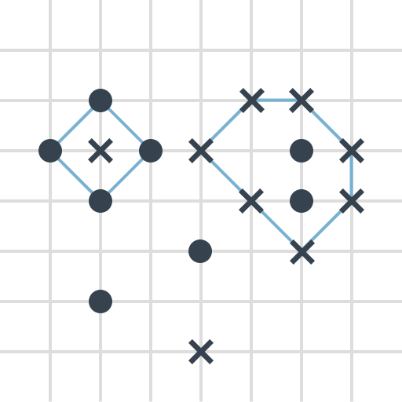

# Точки (упрощенная Го)

Полем является весь листик в клеточку. Игроки ходят по очереди, **ставя за ход одну точку**. Точки можно ставить только на пересечении вертикальных и горизонтальных линий на листке.

На точку новую точку рисовать нельзя.

Точка (или группа точек) считается **захваченной** противником, если **противник можем нарисовать по своим точкам замкнутую линию**, где соединяются отрезками по вертикали, или по горизонтали, или по диагонали, но обязательно это должны быть соседние точки. При захвате эта линия и рисуется.

Точки, попавшие в область окружения, далее не участвуют в образовании линий для окружения. Точки, поставленные на краю поля, не окружаются.

Выигрывает тот, у кого больше захваченных точек.

Если ручка одна, то рисуются точки и крестики. На примере ниже у точек одна захваченная точка, а у крестиков — две:

_Рисунок 1 — Пример игровой ситуации_
