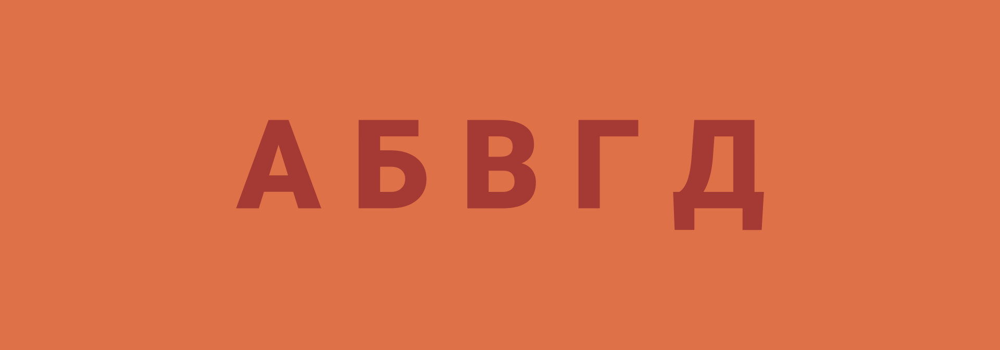

# Вопрос в алфавите

Простая загадка. Когда мы **читаем алфавит**, то мы задаем вопрос о местонахождении маленького млекопитающего. Какого? И почему?

---

**Разгадка** <!-- !details -->

Ёж. А вопрос звучит так: «**Где ёж?**». Посмотрите на алфавит: `абв ГДЕ ЁЖ зийклмно`.

---
