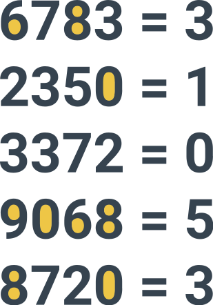

# Странные равенства

Вначале говорится легенда о том, что эту задачу дети решают за минуту, а ученые математики и за день не справятся (на самом деле, это не так, как показывает практика). Итак, на листке бумаги пишутся такие равенства:

_Рисунок 1 — Рисунок задачи_

Требуется написать, чему равно последнее равенство.

Разгадка

Число справа равно числу замкнутых пространств, в написании числа справа. Разберем первое число 6783. В цифре «6» есть одна дырка, в цифре «7» их нет, в цифре «8» их две, а в цифре «3» их опять нет. В сумме 3 дырки. Значит, ответом на последнее равенство будет **3**:

_Рисунок 2 — Решение_

Осторожнее с написанием 4.

