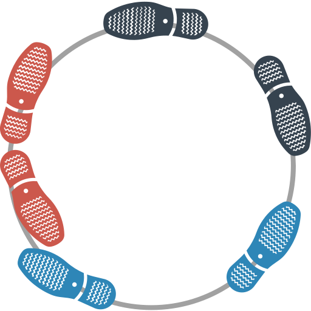
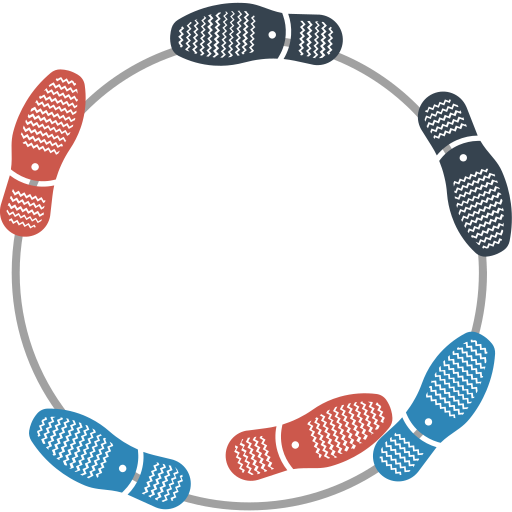
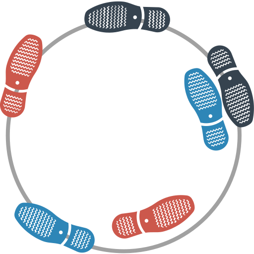
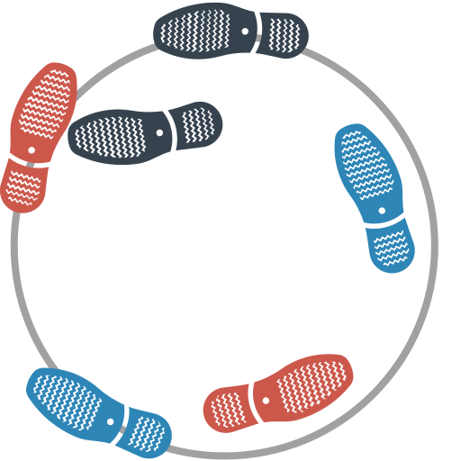

# Заплетающиеся ноги

Очень веселая игра. Игроки встают в тесный кружок.

При этом кладут **руки друг другу на плечи**, прижимаясь корпусами. Ну, это как, когда люди «по-братски» в круг встают.

Теперь один из игроков **приставляет любую свою ногу к любой ноге соседа** справа любым образом.

Теперь сосед должен приставить ногу, которой была приставлена нога, приставить к любой ноге своего соседа справа. Через некоторое время получается неустойчивая структура, где очень сложно удержаться на ногах.

Игра заканчивается, когда люди падают.

Покажем принцип игры на схематичных рисунках. Допустим, три игрока встали в круг:

_Рисунок 1 — Начальная позиция игроков_

«Красный» игрок, например, правую ногу подставил, например, к правой ноге «синего» игрока:

_Рисунок 2 — Первый игрок переставил ногу_

Теперь «синий» игрок должен свою правую ногу подставить к любой ноге «серого» игрока:

_Рисунок 3 — Первый игрок переставил ногу_

Теперь «серый» игрок должен свою левую ногу подставить к любой ноге «красного» игрока:

_Рисунок 4 — Первый игрок переставил ногу_
