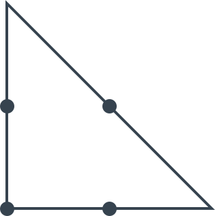
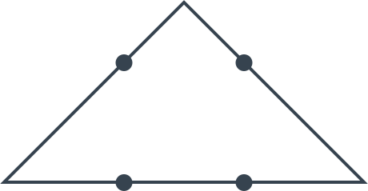

# Три отрезка

Классическая задача. Даны 4 точки:

_Рисунок 1 — Рисунок задачи_

Требуется тремя отрезками соединить все 4 точки, чтобы образовалась **замкнутая фигура, без пересечений**.

---

**Разгадка** <!-- !details -->

Обычно люди не выходят за рамки квадрата, что не позволяет решить задачу. Задача имеет два решения:

_Рисунок 2 — Первое решение_

_Рисунок 3 — Второе решение_

---
