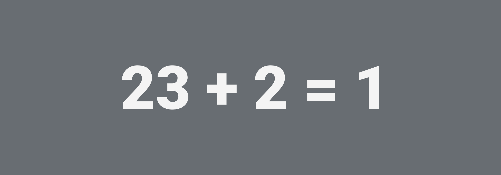

# 23 + 2 = 1



Ведущий рисует на бумаге следующее:

```text
23 + 2 = 1
12 + 3 = 15
1 + 2 = 3
15 + 15 = 6
24 + 5 = ?
```

А потом просит продолжить решить последний пример и объяснить почему.

---

**Разгадка** <!-- !details -->

Это часы, то есть **23** часа плюс **2** часа есть **1** час ночи и так далее. Поэтому последний пример решается так: **24** часа плюс **5** часов равен **5** часов ночи.

---
