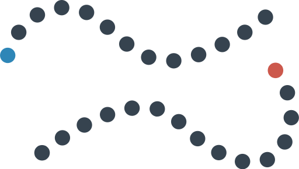

# Две змеи из людей

Подвижная игра. Участники делятся на две равные группы. Люди в каждой группе встают «паровозиком», то есть каждый обхватывает впереди стоящего за пояс. Желательно ухватываться крепко. Получается **две змеи**.

Впереди каждой змеи стоит человек, который объявляется **головой змеи**.

Задача игры в следующем: «змея» выиграет игру, если она своей «головой» **ухватит «хвост» другой змеи**.

«Змея» проиграет, если **разорвется** сама, или ее «разорвет» другая змея своей головой. «Разрыв» — это когда участники оторвались друг от друга:

