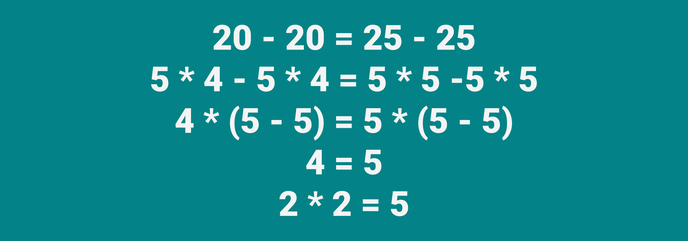

# 2 * 2 = 5



Ведущий рисует на бумаге следующее, говоря, что сейчас откроет истину, которую от всех скрывают:

```text
20 - 20 = 25 - 25
5 * 4 - 5 * 4 = 5 * 5 -5 * 5
4 * (5 - 5) = 5 * (5 - 5)
4 = 5
2 * 2 = 5
```

И просит найти ошибку, или подтвердить, что вся математика ложная.

---

**Разгадка** <!-- !details -->

Ошибка в переводе от третей строки к четвертой при сокращении скобки $(5−5)$. $5−5=0$, а на ноль делить нельзя, поэтому данный переход неверен. Обычно очень долго ищут ошибку.

---
