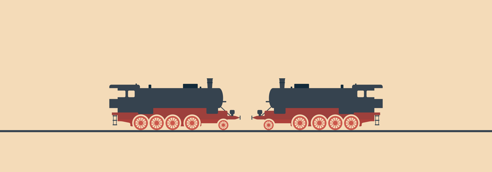

# Два поезда навстречу друг-другу

Это головоломку-прикол лучше проводить после проведения других головоломок, когда люди уже привыкли к нормальному выносу мозга.

Ведущий говорит историю: «Между городами только **одна железная дорога с одними рельсами**. Из городов навстречу вышли два поезда. Едут по одним и тем же рельсам, то есть разъехаться они не могут. Выехали в одно и то же время. Но **они не врезаются**. Почему?»

---

**Разгадка** <!-- !details -->

Это не головоломка, а довольно злой прикол. Ибо разгадка такая: «Не судьба».

---
