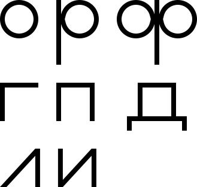
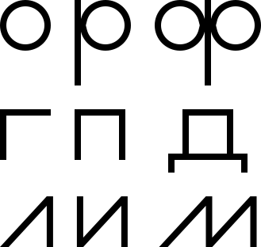

# Какой буквы не хватает

Ведущий рисует на бумаге следующие буквы (форму букв нужно повторить):

_Рисунок 1 — Буквы «о», «р», «a», «г», «п», «д», «л», «и»_

Нужно дописать третью букву в третьем ряду.

Разгадка

В каждом ряду каждая последующая буква **получается из предыдущей в ряду**, добавлением каких-нибудь элементов. Поэтому к букве «**и**» дорисовываем наклонную полочку и получаем букву «**м**»:

_Рисунок 2 — Решение_

